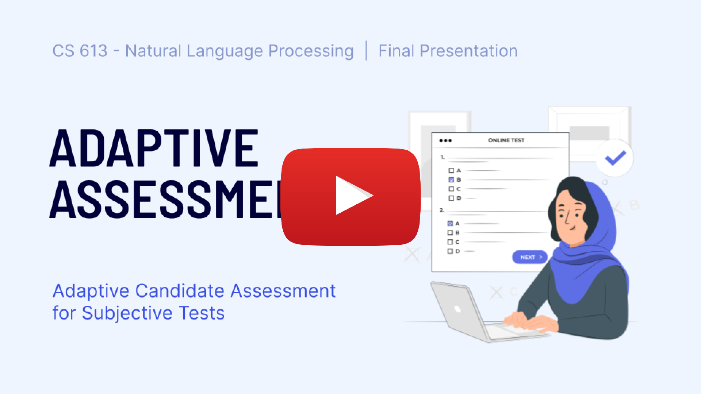
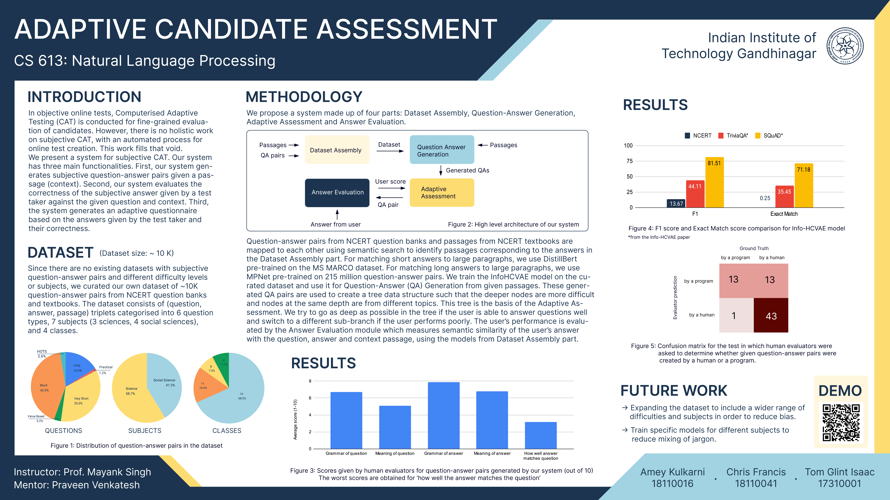

# Adaptive Candidate Assessment for Subjective Tests

CS 613: Natural Language Processing 

## Demo Web App

[adaptive.glintx.com:5000](adaptive.glintx.com:5000) - On localhost currently due to technical issues related to the GPU performance of server.

## Video

## Slides

* [Phase 1](https://docs.google.com/presentation/d/1In9oAEkpLoQjXukMRCoO7kioKg02y8UWzsSfYK-ZCvI/edit?usp=sharing)
* [Phase 2](https://docs.google.com/presentation/d/1Uy2attg-xa5z94tJlNAXV9JEql_b3-0ABhTJHovFe0c/edit?usp=sharing)
* [Phase 3](https://docs.google.com/presentation/d/1WF2tA8L9DOuEEnShJb4Ig5zB5kmGsTT1-1LA_mvSB-Q/edit?usp=sharing)

## Poster

## Team 

* Amey Kulkarni (18110016)
* Chris Francis (18110041)
* Tom Glint Isaac (17310001)

## Instructor 

Prof. Mayank Singh

## Mentor

Praveen Venkatesh
